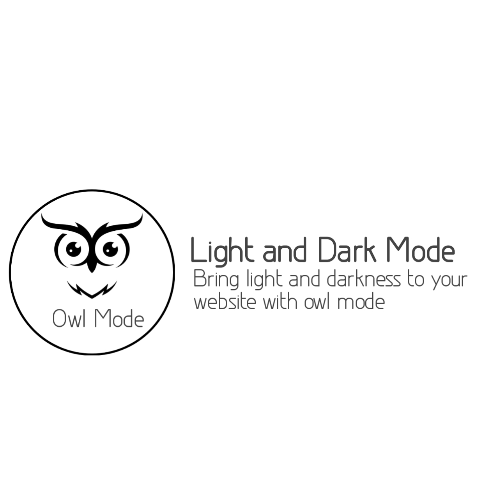

# OwlMode
Owl mode helps you with  dark and light mode to your website

<h1>Usage</h1>
<b>Html Code</b>
<code><pre>
&lt;div class=&quot;fixed-top-right&quot;&gt;
  &lt;input type=&quot;checkbox&quot; class=&quot;checkbox&quot; id=&quot;checkbox&quot;&gt;
  &lt;label for=&quot;checkbox&quot; class=&quot;checkbox-label&quot;&gt;
    &lt;i class=&quot;fas fa-moon&quot;&gt;&lt;/i&gt;
    &lt;i class=&quot;fas fa-sun&quot;&gt;&lt;/i&gt;
    &lt;span class=&quot;ball&quot;&gt;&lt;/span&gt;
  &lt;/label&gt;
</code>
</pre>

<bCss code</b>
<pre>
  <code>
    .checkbox-label .ball {
  background-color: #fff;
  width: 22px;
  height: 22px;
  position: absolute;
  left: 2px;
  top: 2px;
  border-radius: 50%;
  transition: transform 0.2s linear;
}

.checkbox:checked + .checkbox-label .ball {
  transform: translateX(24px);
}

  </code>
</pre>

